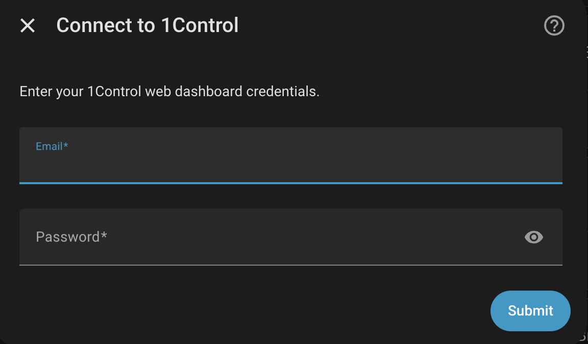
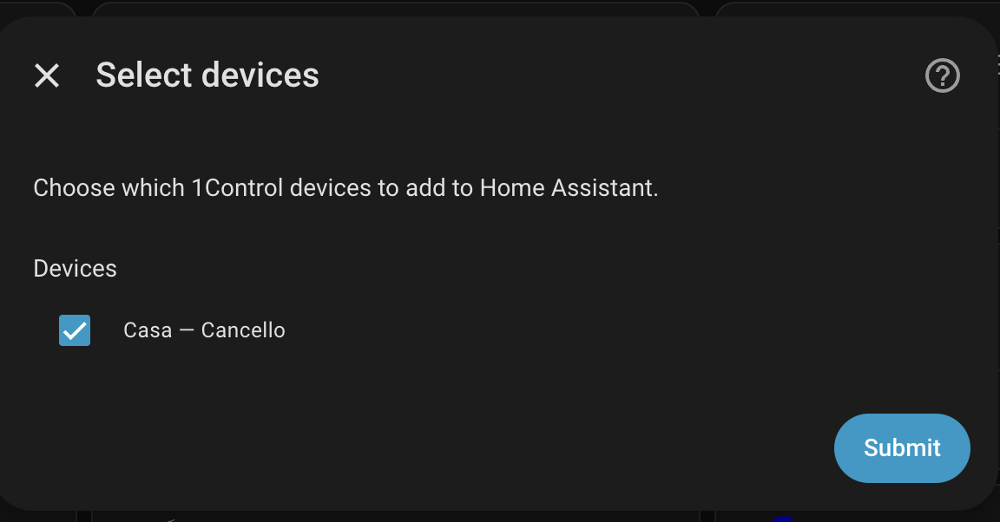
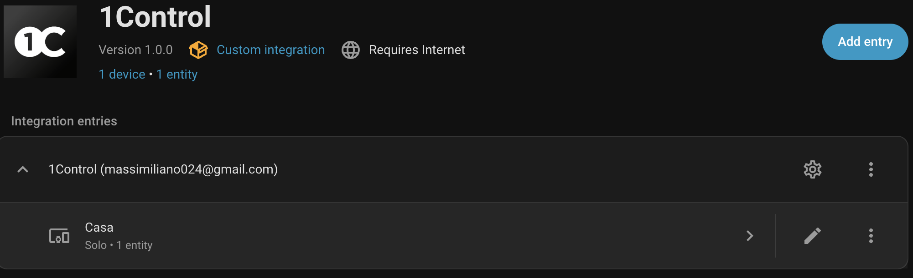
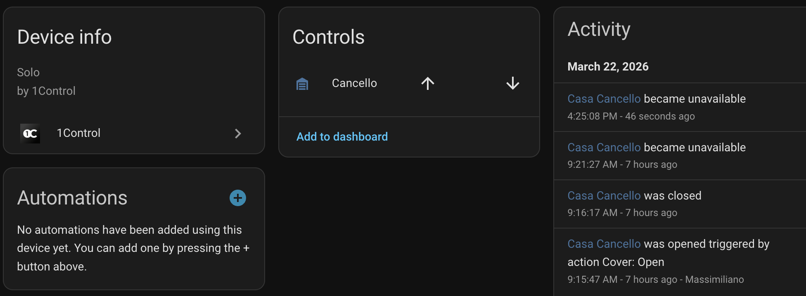
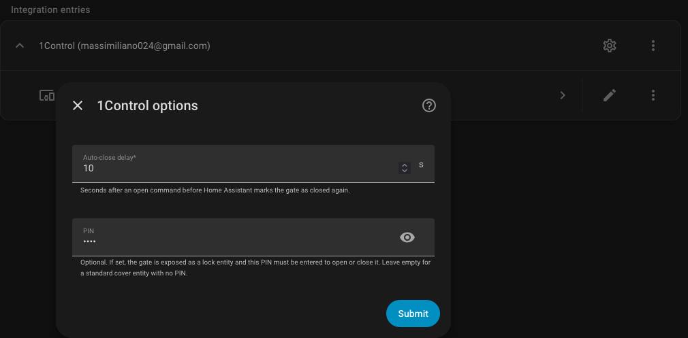

# 1Control for Home Assistant

[](https://github.com/hacs/integration)

> **Disclaimer:** This is an unofficial, community-made integration and is not affiliated with, endorsed by, or supported by 1Control. Use at your own risk.
>
> This integration was vibe coded with [Claude](https://claude.ai) — it works, but treat it accordingly.

A Home Assistant custom integration for **1Control Solo** gates and doors (via a Link bridge) and **1Control Dory** door/gate position sensors. Everything runs against the official 1Control cloud — no local hub required beyond the Link bridge for Solo control.

## Features

**Solo gates/doors**

- Automatically discovers all gates/doors linked to your 1Control account
- Each configured action appears as a **Cover** entity (device class: Gate)
- Supports open and close commands
- Optional **PIN protection** — when a PIN is set, the gate is exposed as a **Lock** entity that prompts for the PIN before opening or closing

**Dory door/gate sensors**

- Automatically discovers all Dory sensors linked to your 1Control account
- Each Dory appears as a **Binary sensor** (device class: Garage door) reflecting the real open/closed state reported to the cloud
- Plus two diagnostic sensors per Dory: **Battery** (raw value) and **Last state change** (timestamp)
- Cloud-polled at a user-configurable interval (default 60 s, minimum 30 s)

## Requirements

- A 1Control web account (see below)
- Home Assistant 2024.1 or later
- At least one of:
  - A **Solo** device paired with a **Link** bridge (for cover/lock control), and/or
  - A **Dory** door/gate sensor (for binary_sensor + diagnostic sensors)

## Setting up a 1Control web account

If you already have the 1Control dashboard set up and linked to your Solo device you can skip this step.

1. Create an account at [web.1control.eu](https://web.1control.eu/)
2. Make a note of your email and password — you will need them during integration setup
3. Once the account is created, go to the [dashboard](https://web.1control.eu/web/en/#/dashboard)
4. Click **Add** in the "Add device" section and select **Solo device**
5. Follow the on-screen guide to add a web user to your Solo device

> **Note:** You need to be physically close to your 1Control Solo during this setup step.

## Installation

### Via HACS (recommended)

> **Prerequisites:** You need [HACS](https://hacs.xyz/) installed in your Home Assistant. If you don't have it yet, follow the [HACS installation guide](https://hacs.xyz/docs/use/download/download/) first.

**Step 1 — Add the repository to HACS:**

[](https://my.home-assistant.io/redirect/hacs_repository/?owner=andriensis&repository=ha-1control&category=integration)

Click the button above to add the repository. This opens HACS in your Home Assistant and adds the 1Control repository. If the button doesn't work, add it manually:

1. Open **HACS** > **Integrations** > click the **three-dot menu** (top right) > **Custom repositories**
2. Paste `https://github.com/andriensis/ha-1control/` as the URL
3. Select **Integration** as the category and click **Add**

**Step 2 — Download the integration:**

1. In HACS, find **1Control** in the integration list (search if needed)
2. Click on it, then click **Download** (bottom right)
3. Select the latest version and confirm
4. **Restart Home Assistant**

**Step 3 — Add the integration to Home Assistant:**

[](https://my.home-assistant.io/redirect/config_flow_start/?domain=onecontrol)

Click the button above to start the setup, or go to **Settings > Devices & Services > + Add Integration** and search for **1Control**.

### Manual

1. Copy the `custom_components/onecontrol/` folder into your HA `config/custom_components/` directory
2. Restart Home Assistant

> **Note:** manual installs don't receive update notifications. To stay on the latest version you'll need to watch this repository for new releases and re-copy the folder each time. Use [HACS](#via-hacs-recommended) if you'd like automatic update notifications in Home Assistant.

## Setup

1. Go to **Settings → Devices & Services → Add Integration**
2. Search for **1Control**
3. Enter your 1Control account email and password
4. Select which gates/doors to add — each configured action on a Solo appears as a separate entity

Dory sensors found on the account are added automatically and do not require selection. If your account has only Dory sensors (no Solo), step 4 is skipped.

## Screenshots

| Login | Select devices |
|-------|---------------|
|  |  |

| Integration | Gate entity |
|-------------|------------|
|  |  |

| Integration settings |
|----------------------|
|  |

## Entities

**Solo** (one entity per configured action)

| Entity type | Device class | Supported features | When used |
|-------------|-------------|-------------------|-----------|
| Cover | Garage | Open, Close | No PIN configured (default) |
| Lock | — | Lock, Unlock (PIN required) | PIN configured in options |

State is tracked **optimistically**: after an open/unlock command the entity reports open, then automatically reverts to closed/locked after the configured auto-close delay to mirror the gate's physical auto-close behaviour. There is no real-time state feedback from the cloud API for Solo devices.

**Dory** (three entities per Dory, under one device row)

| Entity type | Device class | Category | Notes |
|-------------|--------------|----------|-------|
| Binary sensor | Garage door | — | On = open, off = closed; mirrors the state the Dory last reported to the cloud |
| Sensor (Battery) | Enum (`low` / `medium` / `high`) | — | Categorised from the Dory's 2× CR2032 cell-pair voltage. Raw mV value still available as the `raw_mv` attribute |
| Sensor (Last state change) | Timestamp | Diagnostic | When the Dory most recently transitioned between open and closed |

Dory state is **cloud-polled** rather than push-driven: the entity reflects whatever the cloud most recently received from the sensor, so end-to-end latency depends on both the polling interval and how often the Dory itself reports. To stay automation-friendly, Dory entities deliberately **do not flip to "unavailable" on transient cloud hiccups** — they keep showing the last known state until the next successful poll.

## Options

Open the integration's **Configure** button (**Settings → Devices & Services → 1Control → Configure**) to adjust:

- **Auto-close delay** — seconds after an open command before Home Assistant marks the gate as closed again. Tune this to match your gate's physical auto-close timing.
- **PIN** — optional. Leave empty (default) to keep the standard cover entity with no PIN. Enter a value to expose the gate as a **lock** entity instead: Home Assistant's lock card will then prompt for this PIN before opening or closing. All-digit PINs show a numeric keypad.
- **Dory polling interval** *(only shown if your account has Dory sensors)* — how often Home Assistant polls the 1Control cloud for Dory state. Default 60 s; minimum 30 s. Lower values give faster updates at the cost of more requests to the 1Control API; the cloud-side state only updates as fast as the sensor itself reports, so very low values offer diminishing returns.

Changing the PIN (setting, clearing, or updating it) reloads the integration and swaps between the cover and lock entity. Existing dashboard cards and automations referencing the old entity ID will need to be updated to the new one.

> **Note on PIN security:** the PIN is a convenience gate to prevent casual/accidental opens from the Home Assistant UI. It is stored in plain text in your Home Assistant config and is not a substitute for proper access control.

## Architecture & credentials

```
Home Assistant
      │
      │  email + password (stored in HA config entry)
      ▼
1Control Firebase Auth  ──►  short-lived ID token (1 hour, auto-refreshed)
      │
      │  Bearer token + API key
      ▼
1Control Cloud API (onecontrolcloud.appspot.com)
      │
      ├── trigger command ──►  Link bridge  ──►  Solo device  ──►  gate/door
      │
      └── poll state     ◄──  Dory sensor (door position + battery)
```

**Your credentials are never sent anywhere except 1Control's own servers.** The email and password you enter are used solely to obtain a Firebase ID token from 1Control's authentication service — the same call the official mobile app makes. The token is short-lived and automatically refreshed; your password is only used again if the refresh token expires. No credentials are logged or transmitted to any third party.

## Troubleshooting

- **"No devices found"** — for Solo, ensure it has at least one configured action (cloned action) in the 1Control app and that a Link bridge is paired to it. For Dory-only accounts, ensure the Dory is registered to your 1Control account.
- **"Invalid auth"** — double-check your 1Control app email and password.
- **Gate triggered but HA shows error** — check the HA logs (`Settings → System → Logs`) for details from the `onecontrol` component.
- **Dory state is stale** — Dory is cloud-polled; the displayed state reflects the latest update the cloud has from the sensor. Drop the polling interval in the integration options if you need faster refreshes, but note that the cloud itself only updates as fast as the Dory reports.
- **A new Dory (or Solo) doesn't appear after I added it in the 1Control app** — devices are snapshotted at integration setup. Remove and re-add the integration to pick up newly added hardware.

## Contributing

Pull requests are welcome. Please open an issue first for significant changes.

## License

MIT
